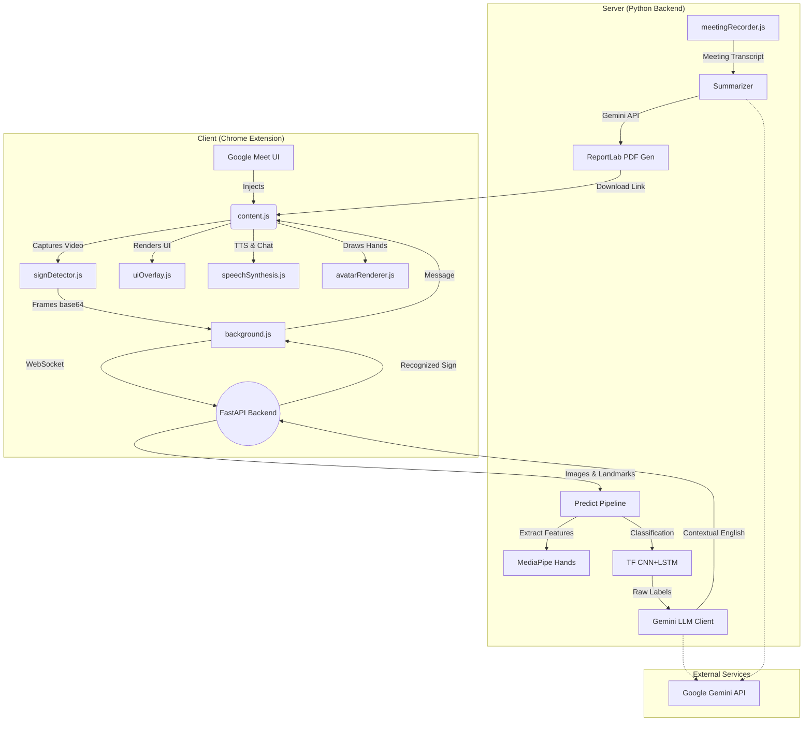

# SignBridge

**LLM-Enhanced Real-Time Sign Language Recognition for Google Meet**

SignBridge is a full-stack, AI-powered Chrome Extension and Python Backend that bridges the communication gap in video meetings. It uses real-time computer vision to detect sign language, translates it to fluent English using Google Gemini, speaks it out loud, and visually renders other people's speech back into a sign language avatar.


## 🚨 The Problem
In today's hybrid world, platforms like Google Meet have become essential for education, corporate meetings, healthcare, and government services. However, these platforms remain largely inaccessible to over **70 million deaf and hard-of-hearing individuals** worldwide who rely on sign language as their primary mode of communication.
Existing accessibility features focus heavily on speech-to-text, ignoring sign language users. This results in severe communication gaps, workplace inclusion challenges, and reduced participation in digital learning. There is a critical need for an intelligent, low-latency, AI-driven system that can translate sign language in real-time on live video platforms.

## 💡 Our Solution
We propose **SignBridge AI** — an LLM-powered, real-time sign language translation assistant for Google Meet. Unlike traditional gesture classifiers, our innovative system combines:
- **Computer Vision**: Live hand tracking using MediaPipe.
- **Deep Learning**: High-accuracy gesture classification with TensorFlow.
- **Large Language Models**: Powered by Google Gemini. Transforms raw gesture sequences into natural, context-aware, and grammatically correct sentences.
- **Seamless Meet Integration**: A Chrome Extension overlay that operates directly inside Google Meet with <200ms latency.

## 🌍 Social Impact
SignBridge AI bridges the communication gap between sign language users and mainstream digital platforms. By delivering a real-time, scalable, accessibility-first AI solution, this project demonstrates how AI can move beyond automation to create meaningful social impact, enabling true inclusive digital communication and transforming accessibility standards worldwide.


## Features Features
- **Real-Time Translation**: Captures camera frames (15fps) and predicts signs using a bespoke CNN+LSTM model.
- **LLM Contextualization**: Google Gemini translates raw sign sequences into natural, context-aware sentences.
- **Bi-Directional Communication**: 
  - (Sign → Voice) Invokes Web Speech API to speak your signs on the meeting.
  - (Voice → Sign) Transcribes others' speech and animated a 2D Avatar rendering signs back to you.
- **Meeting Summaries**: Generates beautiful PDF summaries with AI highlighting action items and Deaf/HoH participant contributions.

## Project Architecture

### System Architecture Diagram


### Complete Code Analysis

#### 1. Extension Layer
- **`manifest.json`**: Configures Manifest V3 permissions, allowing injection specifically into `meet.google.com`. Defines background service workers and popup UI assets.
- **Background Service Worker (`background.js`)**: Acts as the central hub managing state. It establishes and maintains a persistent WebSocket connection to the Python backend, handling reconnections automatically if the server drops.
- **Content Scripts (`content.js`, `uiOverlay.js`)**: `content.js` acts as the orchestrator, detecting when a user enters a Meet room. It injects a custom dragging HTML/CSS widget (`uiOverlay.js`) overlaying the Meet UI for real-time status and transcript display.
- **Media Capture & Playback (`signDetector.js`, `speechSynthesis.js`)**: Bypasses Meet's internal streams by requesting discrete `getUserMedia` access. It samples frames at 15fps, downgrades the resolution to 320x240, and encodes them to highly compressed base64 JPEG strings for optimal WebSocket latency. `speechSynthesis.js` utilizes the Web Speech API to inject audio output over the system speakers while simultaneously scraping the DOM to type translations into the Meet chat box.
- **Avatar Rendering (`avatarRenderer.js`)**: Takes normalized 3D hand landmarks returned from the backend and plots them on an HTML5 Canvas using spring-physics animations for smooth transitions.

#### 2. Backend & Communication Layer
- **FastAPI Core (`main.py`, `auth.py`)**: Provides traditional REST endpoints for JWT-based user authentication (backed by SQLite/SQLAlchemy) and meeting transcript ingestion.
- **WebSocket Server (`websocket_server.py`)**: Uses `asyncio` to manage highly concurrent, bidirectional, low-latency streams of image data. It maintains user-specific frame queues to track the temporal state of signs across time.

#### 3. Machine Learning & AI Layer
- **MediaPipe Extractor (`mediapipe_hands.py`)**: Rapidly processes incoming OpenCV frames to extract 21 3D landmarks for both hands, flattening them into a 126-dimensional spatial vector.
- **Dual-Branch Model (`model.py`, `predict.py`)**: 
  - *Branch 1 (Spatial)*: Processes raw RGB frames through a pre-trained `MobileNetV2` to extract visual features (hand shapes, lighting).
  - *Branch 2 (Temporal)*: Processes the sequence of the last 30 `MediaPipe` 126-dim landmark vectors through a 2-layer `LSTM` (Long Short-Term Memory) network to capture movement over time.
  - The branches are concatenated and passed through dense layers to output probabilities across 29 classes.
- **LLM Contextualization (`gemini_client.py`)**: Translating word-for-word ASL gloss to English often sounds robotic. The raw model output is passed to *Google Gemini 1.5 Pro*, which acts as an interpreter agent, smoothing out errors and translating the sequence into natural conversational English based on the ongoing meeting context.

---

## 🛠 Setup Instructions

### 1. Prerequisites
- Python 3.10+
- Google Chrome browser
- Google Gemini API Key

### 2. Backend Setup
1. Navigate to the backend directory:
   ```bash
   cd signbridge/backend
   ```
2. Create standard environment and install requirements:
   ```bash
   python -m venv venv
   source venv/bin/activate  # On Windows: venv\Scripts\activate
   pip install -r requirements.txt
   ```
3. Set up environment variables:
   Copy `.env.example` to `.env` and configure your keys:
   ```env
   GEMINI_API_KEY=your_key_here
   JWT_SECRET_KEY=generate_a_random_string
   DATABASE_URL=sqlite:///./signbridge.db
   ```
4. Start the FastAPI server:
   ```bash
   uvicorn main:app --host 0.0.0.0 --port 8000 --reload
   ```
   *The server will run on `http://localhost:8000`*

### 3. ML Model Preparation (Training)
*If you don't have a pre-trained `sign_model.h5`, follow these steps:*
1. Download a Sign Language alphabet dataset from Kaggle (e.g. ASL Alphabet).
2. Format it into `landmarks.npy`, `images.npy`, and `labels.npy`.
3. Run the training script:
   ```bash
   python -m sign_recognition.train
   ```
   *This saves the best model to `./models/sign_model.h5`*

*(Note: The `predict.py` pipeline has a fallback demonstrative mock if the model is absent, answering with random letters when hands are detected.)*

### 4. Chrome Extension Setup
1. Open Google Chrome and navigate to `chrome://extensions/`
2. Enable **Developer mode** (toggle in the top right corner).
3. Click **Load unpacked**.
4. Select the `signbridge/extension` directory.
5. Pin the SignBridge extension to your toolbar.

---

## 🚀 Usage Guide

1. **Authenticate**: Click the SignBridge extension icon. Sign up for a new account or log in.
2. **Join Google Meet**: Open `meet.google.com` and start or join a meeting.
3. **SignBridge Overlay**: Upon joining, the SignBridge UI will automatically inject into the bottom-right corner.
4. **Connect**: Ensure the status dot turns green (connected to backend websocket).
5. **Start Signing**: 
   - Turn on your camera. (The extension requests camera permission once to capture frames).
   - Sign towards the camera. 
   - Watch the live transcription tick up.
   - The extension will automatically speak the detected sentences into the meeting and type it in the Meet Chat!
6. **Avatar Feedback**: When others speak, watch the 2D rendering avatar in the panel relay the conversation.
7. **Generate Report**: After the meeting ends, click "Download Meeting Summary PDF" in the extension popup.

---

## Technical Details & Security
- **Privacy**: The extension captures frames at low-resolution and encodes them in base64 to send via a secured WebSocket. Frames are *not* stored on the server.
- **Authentication**: JWT tokens are securely stored in Chrome's `local.storage`.

Enjoy seamless communication!
