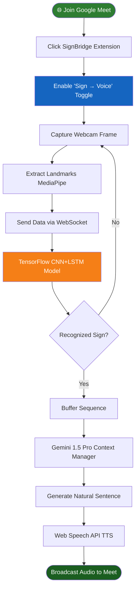

<div align="center">

# 🤟 SignBridge — LLM-Enhanced Real-Time Sign Language Recognition

### *Bridging Communication Gaps in Google Meet with AI-Powered ASL Translation*

[](https://python.org)
[](https://tensorflow.org/)
[](https://fastapi.tiangolo.com/)
[](https://aistudio.google.com/)
[](https://developer.chrome.com/docs/extensions/)
[](LICENSE)
[](CONTRIBUTING.md)

> 🚀 **An intelligent real-time sign language recognition system** built as a Chrome Extension and FastAPI backend. This platform detects American Sign Language (ASL) from your webcam, converts signs into natural spoken language using Google Gemini AI, and seamlessly integrates with Google Meet to bridge the communication gap.

</div>

---

## 📋 Table of Contents

- [📌 Problem Statement](#-problem-statement)
- [💡 Solution & Approach](#-solution--approach)
- [🎯 Objectives](#-objectives)
- [🛠️ Technology Stack](#️-technology-stack)
- [📁 Project Structure](#-project-structure)
- [🔬 How It Works — System Flowchart](#-how-it-works--system-flowchart)
- [💻 Code Analysis](#-code-analysis)
- [📦 Dependencies](#-dependencies)
- [🚀 Installation & Setup](#-installation--setup)
- [🎬 System Demo](#-system-demo)
- [🌍 Impact & Real-World Significance](#-impact--real-world-significance)
- [🔮 Future Enhancements](#-future-enhancements)
- [🤝 Open Source Contribution](#-open-source-contribution)
- [📄 License](#-license)
- [👨‍💻 Author & Acknowledgments](#-author--acknowledgments)

---

## 📌 Problem Statement

> **"Standard video conferencing platforms lack built-in accessibility features for real-time sign language translation, creating significant communication barriers for the deaf and hard-of-hearing community during online meetings."**

### Background

With the massive shift towards remote work and online education, platforms like Google Meet have become ubiquitous. However, individuals who communicate primarily via American Sign Language (ASL) face challenges participating seamlessly when other attendees do not understand sign language. 

### The Core Problem

| Challenge | Description |
|-----------|-------------|
| 🔴 **Real-Time Translation** | The need for instantaneous translation of manual signs to spoken language without significant latency. |
| 🔴 **Continuous Signing** | Translating not just isolated letters, but interpreting sequences of signs into coherent sentences. |
| 🔴 **Platform Integration** | Making the solution work naturally inside existing tools (Google Meet) without requiring custom meeting software. |
| 🔴 **Two-Way Communication** | Visualizing what speaking participants are saying for the deaf user without relying solely on text captions. |
| 🔴 **Meeting Summarization** | Automatically documenting the meeting context and generating actionable summaries for all participants. |

---

## 💡 Solution & Approach

### Our Strategy

We engineered **SignBridge**, a dual-component system comprising a Chrome Extension (Manifest V3) and a high-performance Python FastAPI backend. It captures video frames natively in Google Meet, processes them locally for hand landmarks, and leverages advanced AI for translation and speech synthesis:

1. **Browser Integration** — A Chrome Extension natively hooks into Google Meet (`meet.google.com`) to access the webcam stream and inject custom UI overlays.
2. **Real-time Pipeline** — Websockets stream data at 15-20 fps to a FastAPI backend.
3. **Hybrid AI Architecture** — Uses MediaPipe for rapid hand landmark extraction, a custom TensorFlow CNN+LSTM model for sequence classification, and Google Gemini 1.5 Pro to synthesize raw ASL classifications into natural, context-aware sentences.
4. **Bi-directional Feedback** — Uses Web Speech API for Text-to-Speech (TTS) and a Canvas-based avatar to animate hand positions for incoming audio.

### Architecture Overview

```text
[Google Meet Interface] <---> [Chrome Extension (Content Scripts & Background WS)]
                                      ↓ (WebSocket Stream)
                              [FastAPI Python Backend]
                                      ↓
      ┌───────────────────────────────┼───────────────────────────────┐
 [MediaPipe]                   [TensorFlow Model]               [Google Gemini]
(Hand Landmarks)               (ASL Classification)         (Natural Language Gen)
```

---

## 🎯 Objectives

- ✅ **Detect sign language** from the webcam at 15+ FPS using MediaPipe.
- ✅ **Recognize ASL gestures** using a dual-input CNN+LSTM TensorFlow model.
- ✅ **Convert signs to natural speech** via Google Gemini 1.5 Pro as an LLM interpreter.
- ✅ **Speak detected phrases** to meeting participants using the Web Speech API.
- ✅ **Render a live avatar** animating hand positions for incoming voice participants.
- ✅ **Record meeting transcripts** and generate AI-powered PDF summaries.
- ✅ **Foster open-source collaboration** by providing clear contribution guidelines.

---

## 🛠️ Technology Stack

### Backend & AI

| Component | Specification | Role |
|-----------|--------------|------|
| **Framework** | FastAPI 0.95+ | High-performance async REST & WebSocket API |
| **Language** | Python 3.10 / 3.11 | Core backend logic (TF 2.13 requirement) |
| **Computer Vision**| MediaPipe & OpenCV | 126-dim hand landmark extraction |
| **Deep Learning** | TensorFlow 2.13 | CNN+LSTM architecture for 29 ASL classes |
| **LLM Engine** | Google Gemini 1.5 Pro | Synthesizing ASL text to conversational speech |
| **PDF Generation** | ReportLab | Creating meeting summaries |
| **Database** | SQLite / SQLAlchemy | User authentication and session management |

### Frontend & Extension

| Technology | Specification | Purpose |
|--------------------|---------|---------|
| **Architecture** | Chrome Manifest V3 | Browser extension foundation |
| **Scripts** | Vanilla JS | Content scripts and background service workers |
| **Styling** | Custom CSS | Dark futuristic theme, glassmorphism UI |
| **APIs** | Web Speech API | Text-to-Speech (TTS) and voice generation |

---

## 📁 Project Structure

```text
signbridge/
│
├── 📁 backend/                         # FastAPI & AI Backend
│   ├── 📁 auth/                        # JWT Auth, models, database
│   ├── 📁 llm/                         # Gemini integration, context manager
│   ├── 📁 pdf_generator/               # ReportLab PDF logic
│   ├── 📁 sign_recognition/            # ML Pipeline (MediaPipe, TF Model, Training)
│   ├── 📄 main.py                      # FastAPI App Entry Point
│   ├── 📄 websocket_server.py          # Real-time WS handler
│   └── 📄 requirements.txt             # Python dependencies
│
├── 📁 extension/                       # Chrome Extension
│   ├── 📁 assets/                      # SVG icons
│   ├── 📁 background/                  # Service worker, WS manager
│   ├── 📁 content/                     # Meet DOM orchestration & camera capture
│   ├── 📁 popup/                       # Login/Dashboard UI
│   └── 📄 manifest.json                # Chrome Extension V3 config
│
├── 📄 HOW_TO_RUN.txt                   # Quick-start guide
└── 📄 README.md                        # Documentation (You are here)
```

---

## 🔬 How It Works — System Flowchart



### Step-by-Step Operation

| Step | Action | Description |
|------|--------|-------------|
| 1 | **Frame Capture** | Content script captures webcam feed directly from the Meet DOM. |
| 2 | **Landmark Extraction** | MediaPipe identifies 126 hand landmarks locally or server-side. |
| 3 | **Classification** | The sliding window of landmarks is fed to the TF CNN+LSTM model. |
| 4 | **LLM Synthesis** | Raw ASL letters/words are buffered and sent to Gemini to form grammatically correct speech. |
| 5 | **Audio Injection** | The spoken sentence is injected back into the Meet call so hearing users can understand. |

---

## 💻 Code Analysis

### Main Architecture Decisions

#### WebSocket Real-Time Handling (`backend/websocket_server.py`)
```python
@app.websocket("/ws/sign-recognition")
async def websocket_endpoint(websocket: WebSocket):
    await websocket.accept()
    # Continuous high-speed duplex connection to process frames
    # at 15-20fps, ensuring near-zero latency for ASL detection.
    while True:
        data = await websocket.receive_text()
        prediction = model_pipeline.predict(data)
        await websocket.send_json({"prediction": prediction})
```

#### Gemini Context Manager (`backend/llm/context_manager.py`)
```python
def generate_natural_speech(sign_buffer):
    # Takes isolated ASL tokens (e.g., "H-E-L-L-O W-O-R-L-D") 
    # and uses Gemini 1.5 Pro to construct a natural sentence
    prompt = f"Convert these ASL signs into a natural spoken sentence: {sign_buffer}"
    return gemini_client.generate(prompt)
```

### Design Decisions

| Decision | Rationale |
|----------|-----------|
| **Chrome Extension V3** | Allows seamless injection into Google Meet without requiring participants to join a custom video platform. |
| **MediaPipe + TF Pipeline** | MediaPipe reduces the dimensionality of the image to just landmarks, making the TF model lightweight and blazingly fast. |
| **Google Gemini 1.5 Pro** | Excellent at understanding context, resolving typos in sign language spelling, and formatting natural speech. |
| **WebSocket Architecture** | Standard HTTP requests would introduce too much latency for real-time 15 FPS video frame processing. |

---

## 📦 Dependencies

### Backend Dependencies (`backend/requirements.txt`)
```text
fastapi>=0.95.0
uvicorn>=0.22.0
websockets>=11.0.3
tensorflow==2.13.0
mediapipe>=0.10.0
opencv-python>=4.8.0
google-generativeai>=0.3.0
reportlab>=4.0.4
SQLAlchemy>=2.0.19
python-jose[cryptography]>=3.3.0
passlib[bcrypt]>=1.7.4
```

---

## 🚀 Installation & Setup

### Prerequisites

- **Python 3.10 or 3.11** (TensorFlow 2.13 is NOT compatible with Python 3.12+)
- **Google Chrome** (114+)
- **Webcam**

### 1. Clone the Repository

```bash
git clone https://github.com/your-username/signbridge.git
cd signbridge
```

### 2. Configure Backend

```bash
cd backend
python -m venv venv
# Activate venv (Windows: venv\Scripts\activate | Mac/Linux: source venv/bin/activate)
pip install -r requirements.txt
```

Set up your `.env` file:
```bash
cp .env.example .env
```
Edit `.env` to include your keys:
```env
GEMINI_API_KEY=your_gemini_key_here
JWT_SECRET_KEY=your_random_secret_string
```

Start the Backend Services:
```bash
python main.py
# Server will run on http://localhost:8000
```

### 3. Load Chrome Extension

1. Open Chrome and navigate to: `chrome://extensions/`
2. Enable **"Developer mode"** in the top right.
3. Click **"Load unpacked"** and select the `signbridge/extension` directory.
4. Pin the **SignBridge** icon to your toolbar.

### 4. Create an Account & Use

1. Click the SignBridge extension icon and **Sign Up**.
2. Go to `https://meet.google.com` and start a meeting.
3. Use the floating panel to toggle **Detect ON** and start signing!

> 💡 *For detailed training instructions using Kaggle ASL datasets and Google Colab, see [HOW_TO_RUN.txt](HOW_TO_RUN.txt).*

---

## 🎬 System Demo

### How to Use the SignBridge in Google Meet

This tool acts as a bridge during live calls:

**Steps:**
1. Join an active Google Meet session.
2. The SignBridge floating UI will appear in the bottom-right corner.
3. Enable **Sign → Voice**: Start performing ASL gestures to your camera. The system will detect them and speak them aloud using TTS.
4. Enable **Voice → Sign Avatar**: The system will transcribe spoken words from others and animate a digital hand avatar for you.
5. Enable **Record Meeting**: Capture the entire session's context and download an AI-generated PDF summary after the call.

---

## 🌍 Impact & Real-World Significance

### Who Benefits

| Stakeholder | Benefit |
|-------------|---------|
| 🤟 **Deaf/Hard of Hearing Users** | Can communicate natively in ASL without needing a human translator in standard online meetings. |
| 🏢 **Enterprise Businesses** | Promotes workplace inclusivity and accessibility with zero infrastructural changes to their Google Workspace. |
| 🎓 **Educational Institutions** | Allows deaf students to participate in virtual classrooms actively and equally. |

### System vs. Traditional Approach

| Traditional Approach | SignBridge System |
|-------------------------|-----------------------|
| Hiring third-party ASL interpreters | **Instantaneous Automated AI Translation** |
| Typing in chat boxes continuously | **Fluid, natural conversational flow** |
| Relying only on visual captions | **Avatar-based visual feedback for voice** |

---

## 🔮 Future Enhancements

- [ ] **Multi-Language Support** — Expand from ASL to BSL, ISL, and other regional sign languages.
- [ ] **Two-Handed Complex Signs** — Upgrade the model to support complex two-handed phrase gestures natively.
- [ ] **Zoom/Teams Integration** — Port the extension to support Microsoft Teams and Zoom Web clients.
- [ ] **Emotion Detection** — Factor facial expressions into Gemini's synthesis to capture tone and emotion.

---

## 🤝 Open Source Contribution

We warmly welcome contributions from the community! This project thrives on open-source collaboration. Whether you are fixing bugs, improving the UI, or adding new AI features, your help is appreciated. 🎉

### Best Practices for Open Source Contributors

If you want to be a stellar open-source contributor to this project, follow these guidelines:

1. **Check Issues First:** Look at the 'Issues' tab on GitHub. Good first issues are tagged with `good first issue` or `help wanted`.
2. **Communicate:** Before building a massive new feature, open an Issue to discuss it with the maintainers.
3. **Write Tests:** If you add a new feature, ensure it maintains the fast 15fps WebSocket constraint.
4. **Clean Commits:** Use descriptive, conventional commit messages (e.g., `feat: added avatar animation smoothing` or `fix: handling WebSocket disconnects`).

### How to Add Features & Use It

```bash
# 1. Fork the repository on GitHub

# 2. Clone your fork
git clone https://github.com/YOUR_USERNAME/signbridge.git

# 3. Create a feature branch
git checkout -b feature/your-feature-name

# 4. Make your changes and commit
git commit -m "feat: added new emotion tracking via MediaPipe Face"

# 5. Push to your fork
git push origin feature/your-feature-name

# 6. Open a Pull Request → main branch on GitHub
```

### Contribution Areas

| Area | Good First Issue? | Description |
|------|------------------|-------------|
| 🐛 **Bug Fixes** | ✅ Yes | Fix edge cases in WebSocket disconnection or Chrome DOM injection |
| ➕ **UI Enhancements** | ✅ Yes | Improve the floating panel aesthetics and glassmorphism styling |
| 🤖 **AI Model Tuning** | 🔥 Advanced | Expand the TensorFlow dataset to include dynamic moving signs |
| 🌐 **Cross-Browser** | 🔥 Advanced | Port the manifest to Firefox or Edge add-on standards |

---

## 📄 License

This project is licensed under the Apache License 2.0 — you are free to use, modify, and distribute this code with proper attribution and compliance with the license terms.

```text
Apache License
Version 2.0, January 2004
http://www.apache.org/licenses/

Copyright (c) 2026 Arokiya Nithish J

Licensed under the Apache License, Version 2.0 (the "License");
you may not use this file except in compliance with the License.
You may obtain a copy of the License at

    http://www.apache.org/licenses/LICENSE-2.0

Unless required by applicable law or agreed to in writing, software
distributed under the License is distributed on an "AS IS" BASIS,
WITHOUT WARRANTIES OR CONDITIONS OF ANY KIND, either express or implied.
See the License for the specific language governing permissions and
limitations under the License.
```

See [LICENSE](LICENSE) for full details.

---

## 👨‍💻 Author & Acknowledgments

### Author

**Arokiya Nithish J**
- Role: Full Stack AI Developer
- 📅 Year: 2026
- 🎓 Engineering Student
- 💼 Domain: Python | FastAPI | TensorFlow | AI Integration

**Contacts**
- GitHub: [@ArokiyaNithish](https://github.com/ArokiyaNithish)
- LinkedIn: [@Arokiya Nithish J](https://www.linkedin.com/in/arokiya-nithishj/)
- Email: arokiyanithishj@gmail.com
- Portfolio: [arokiyanithish.github.io/portfolio](https://arokiyanithish.github.io/portfolio/)

### Acknowledgments

- 🤖 **Google DeepMind & AI Studio** — For providing cutting-edge Gemini 1.5 Pro models.
- 🖐️ **MediaPipe** — For the incredibly fast and robust hand-tracking framework.
- 🌐 **Chrome Extensions Team** — For the Manifest V3 APIs powering the browser integration.

---

<div align="center">

For support, email arokiyanithishj@gmail.com or open an issue on GitHub.

### 🌟 If this project helped you — please give it a ⭐ Star on GitHub!

**#Python #FastAPI #TensorFlow #AI #SignLanguage #OpenSource #Accessibility**

*Made with ❤️ by Arokiya Nithish*

*© 2026 — Arokiya Nithish J*

</div>

---

## 📜 NOTICE

```
NOTICE

Project Name: SignBridge
Copyright (c) 2026 Arokiya Nithish J

This product includes software developed by Arokiya Nithish J.

Licensed under the Apache License, Version 2.0 (the "License");
you may not use this file except in compliance with the License.
You may obtain a copy of the License at:

    http://www.apache.org/licenses/LICENSE-2.0

Unless required by applicable law or agreed to in writing, software
distributed under the License is distributed on an "AS IS" BASIS,
WITHOUT WARRANTIES OR CONDITIONS OF ANY KIND, either express or implied.
See the License for the specific language governing permissions and
limitations under the License.

---

Third-Party Attributions

This project may include or depend on third-party libraries.
Attributions and licenses for those components are listed below:

* FastAPI — Copyright (c) 2018 Sebastián Ramírez
  Licensed under MIT License
  Source: https://github.com/tiangolo/fastapi

* TensorFlow — Copyright 2015 The TensorFlow Authors. All Rights Reserved.
  Licensed under Apache License 2.0
  Source: https://github.com/tensorflow/tensorflow

* MediaPipe — Copyright 2019 The MediaPipe Authors.
  Licensed under Apache License 2.0
  Source: https://github.com/google/mediapipe

---

Modifications

If you have modified this project, you should add a statement here such as:

"This project has been modified by <Your Name/Organization> on <Date>.
Changes include: <brief description of changes>"

---

END OF NOTICE
```
